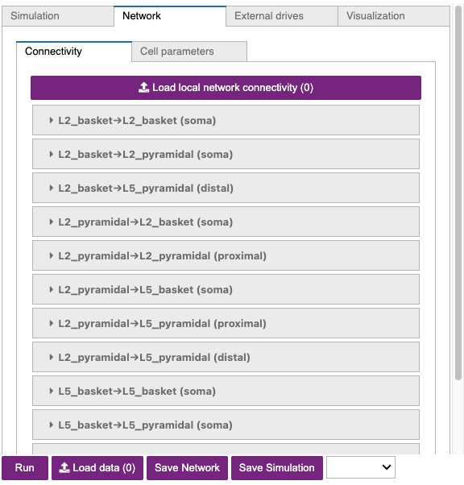

<!--
# Title: 7.1 GUI Tutorial of Gamma Rhythms
# Updated: 2025-02-14
#
# Contributors:
    # Dylan Daniels
-->

# 7.1 GUI Tutorial of Gamma Rhythms

## Tutorial Table of Contents

1. [Background](#toc-1)

2. [Downloading HNN Parameter Set Files](#toc-2)

3. [Setting Initial Run Parameters](#toc-3)

4. [Load/view Parameters of the Network Structure](#toc-4)

5. [Load/view Parameters of the External Drive](#toc-5)

6. [Run the Simulation and Visualize the Dipole and Spectrogram](#toc-6)

7. [Calculating and Viewing Spiking Activity and Power Spectral Density (PSD)](#toc-7)

8. [Adjusting parameters](#toc-8)

    - [8.1 Restricting Spiking to L5](#toc-8-1)
    - [8.2 Increasing Cell Excitability via a Weak Tonic Input](#toc-8-2)
    - [8.3 Increasing Tonic Input](#toc-8-3)
    - [8.4 Weakening the Excitatory Connections](#toc-8-4)
    - [8.5 Removing the Inhibitory Connections](#toc-8-5)
    - [8.6 Reducing the GABAA Decay Time](#toc-8-6)
    - [8.7 Exercises for Further Exploration](#toc-8-7)

9. ["Strong" gamma can arise from tonic inputs to pyramidal neurons](#toc-9)

10. [Gamma Can Emerge from Rhythmic Subthreshold Synaptic Inputs to Pyramidal Neurons](#toc-10)

    - [10.1 Adding Noise to Gamma Generated through Rhythmic Subthreshold Synaptic Inputs](#toc-10-1)
    - [10.2 Exercises for Further Exploration](#toc-10-2)

11. [Have Fun Exploring your Own Data!](#toc-11)

<a id="toc-1"></a>

## 1. Background

In order to understand the workflow and initial parameter sets provided with this tutorial, we must first briefly describe prior studies on the mechanistic origin of gamma rhythms, including our prior modeling work that led to the creation of the parameter sets you will work with [@lee_distinguishing_2013].

Gamma rhythms can encompass a wide band of frequencies from 30-150 Hz. Here, we will focus on the generation of so called low gamma rhythms in the 30-80 Hz range. It has been well established through experiments and computational modeling that these rhythms can emerge in local spiking networks through interactions of excitatory cell and inhibitory cell interactions, with the period of the oscillation set by the time constant of decay of GABAA-mediated inhibitory currents ([@cardin_driving_2009], [@vierling-claassen_computational_2010], [@buzsaki_mechanisms_2012]), a mechanism that has been referred to as pyramidal-interneuronal gamma (PING). In normal regimes, the decay time constant of GABAA-mediated synapses (~25 ms) bounds oscillations to the low gamma frequency band (~40 Hz).

In general, PING rhythms are initiated by "excitation" to the excitatory (E) cells that causes spiking, which in turn synaptically activates a spiking population of inhibitory (I) cells. In turn, these I cells inhibit the E cells, preventing further E cell activity until the E cells can overcome the effects of the inhibition (~25 ms later). The pattern is repeated, creating a gamma frequency oscillation (~40 Hz, 40 spikes/second). This general principle is schematically described in Figure 1 below. The frequency of the rhythm is paced by this time constant of decay of inhibition, which is mediated by strong GABA-A currents, as well as the excitability of the E cells (if the E cells are very excitable, they can fire before the inhibition has completely worn off, and the oscillation will be faster).

<div class="stylefig">
### Figure 1
<!-- was originally at  -->

<p align="justify">
Schematic illustration of the circuit mechanisms underlying PING rhythms.
</p>
</div>

In this tutorial, we will explore the generation of PING rhythms in the HNN model. We will provide example parameter files and walk through simulations that generate gamma activity in both Layers 2/3 and Layer 5, as in [@lee_distinguishing_2013]. This tutorial relies on a different type of exogenous drive to "activate" the local network than the other tutorials. Here, the necessary excitation to generate spiking in the pyramidal neurons that initiates the rhythm (see PING description above) is provided by a continuous train of action potentials with a Poisson distribution that activates post-synaptic excitatory AMPA synapses on the pyramidal neurons. This Poisson drive causes the pyramidal neurons to fire, dependent on the chosen conductance of the AMPA currents. The inhibition in the network is strong enough to overcome the Poisson drive and entrain the network spiking into a gamma frequency rhythm.

Of note, gamma rhythms can be generated by circuit mechanisms other than PING, including subthreshold rhythmic exogenous drive. The publication [@lee_distinguishing_2013] examined various mechanisms of generation of gamma activity and described ways to distinguish the mechanisms of generation based on features of current dipole signal. After completing this tutorial, we encourage you to explore alternate mechanisms of gamma generation and to compare to your own gamma data.

<div class="callout callout-warning">
  <table class="callout-table">
    <tr>
      <td class="emoji-cell">
        <svg class="exclamation-icon" viewBox="0 0 16 16" width="20" height="20">
            <path d="M15.35 12.81 9 2.08a1.22 1.22 0 0 0-2 0L.65 12.81a1.14 1.14 0 0 0 1 1.69h12.66a1.14 1.14 0 0 0 1.04-1.69zm-13.66.55L8 2.64l6.31 10.72z"/>
            <path d="M7.32 5.45h1.25V10H7.32z"/>
            <ellipse cx="7.95" cy="11.9" rx=".67" ry=".7"/>
        </svg>
      </td>
      <td class="text-cell">
      Please note that the configuration we use in this Tutorial is for illustrative purposes only. Layer 2/3 and Layer 5 are not interconnected in the simulations in this tutorial, therefore *the network used is not biologically realistic*.
    </td>
      <td class="emoji-cell"> </td>
    </tr>
  </table>
</div>

<a id="toc-2"></a>

## 2. Downloading HNN Parameter Set Files

Throughout this tutorial, we will be using several different HNN parameter set files. These files are not included in the HNN installation, but instead must be downloaded separately. The easiest way to get them is to [click this link, which will download a ZIP file that contains the four files we need](https://download-directory.github.io/?url=https%3A%2F%2Fgithub.com%2Fjonescompneurolab%2Fhnn-data%2Ftree%2Fmain%2Fworkshops%2Fgamma_gui_walkthrough). Alternatively, you can download (or `git clone`) this Github repository: [hnn-data](https://github.com/jonescompneurolab/hnn-data) and then access the files in the `workshops/gamma_gui_walkthrough` directory. These four files are named `gamma_L5weak_L2weak.json`, `gamma_L5weak_only.json`, `gamma_L5ping_L2ping.json`, and `gamma_rhythmic_drive.json`.

Begin by starting the HNN GUI. See our [Installation page](../01_getting_started/installation.html#google-colab) for instructions on either running HNN freely in the cloud or installing it locally. If you are using the Google CoLab notebook or NSG, follow the instructions for starting the GUI. If you are using a local install of HNN, run the following command from a terminal:

```
hnn-gui
```

<a id="toc-3"></a>

## 3. Setting Initial Run Parameters

**Before** running any simulations, we need to change some default parameters of the simulations. Please note that if you refresh the browser tab or restart HNN, you will have to re-enter all of these parameter changes.

1. Change the `Name` of the simulation to `gamma_L5weak_L2weak`.
2. Change `tstop (ms)` from `170` to `300`.
3. Change `Dipole Smoothing` from `30` to `0`. This is necessary so that higher-frequency signal content like gamma can be detected and analyzed correctly.
4. Only if you are using Mac or Linux (not Windows), and only if you installed HNN locally, then do the following (you may have already obtained this number in the initial install):
    i. run the following command in a Terminal: `python -c "import psutil ; print(psutil.cpu_count(logical=False)-1)"`
    ii. read the output number,
    iii. put that number in the `Cores` textbox of the GUI. This will greatly increase your simulation speed.

<a id="toc-4"></a>

## 4. Load/view Parameters of the Network Structure

1. Next, click on the `Network` tab.
2. Inside the tab, click the button `Load local network connectivity (0)`, then select the file `gamma_L5weak_L2weak.json`, which you downloaded previously in [Section 2](#toc-2).

The adjustable network parameters are displayed in the dropdown boxes under the `Connectivity` tab, as shown in [Figure 2](#figure-2) below.

<div class="stylefig">
### Figure 2
<!-- Was originally at (note that 03 and 02 were swapped)  -->

</div>

In our loaded configuration file, the strengths of synaptic connections are significantly different than in the [HNN Template Model](../01_getting_started/template_model.html) for the sake of simulating gamma oscillations. In addition to many connection strengths being increased or decreased, all connections **between** Layer 2/3 and Layer 5 have been turned off (weight = 0 $\mu S$). Connections between excitatory cells within each layer are also turned off. Additionally, note that the inhibitory conductances within layers are stronger than the excitatory conductances, and that there are strong inhibitory-to-inhibitory (i.e., basket-to-basket) connections. This strong autonomous inhibition will cause synchrony among the basket cells, and hence strong inhibition onto the pyramidal neurons.

<div class="callout callout-warning">
  <table class="callout-table">
    <tr>
      <td class="emoji-cell">
        <svg class="exclamation-icon" viewBox="0 0 16 16" width="20" height="20">
            <path d="M15.35 12.81 9 2.08a1.22 1.22 0 0 0-2 0L.65 12.81a1.14 1.14 0 0 0 1 1.69h12.66a1.14 1.14 0 0 0 1.04-1.69zm-13.66.55L8 2.64l6.31 10.72z"/>
            <path d="M7.32 5.45h1.25V10H7.32z"/>
            <ellipse cx="7.95" cy="11.9" rx=".67" ry=".7"/>
        </svg>
      </td>
      <td class="text-cell">
        Keep in mind that because Layer 2/3 and Layer 5 are not connected, *this is not a biologically realistic network*. We use this configuration as a starting point for illustrative purposes only, as it will prevent pyramidal-to-pyramidal interactions from disrupting the gamma rhythm.
    </td>
      <td class="emoji-cell"> </td>
    </tr>
  </table>
</div>

<a id="toc-5"></a>

## 5. Load/view Parameters of the External Drive

1. Next, click the tab labeled: `External drives`.
2. Inside the tab, click the button `Load external drives (0)`, then select the file `gamma_L5weak_L2weak.json`, which you downloaded previously in [Section 2](#toc-2). This is the same file you just selected in [Section 4](#toc-4).
3. Click the dropdown menu labeled `extpois (proximal)`.

You should now see a dropdown menu which contains the adjustable drive parameters, as shown in [Figure 3](#figure-3) below. These parameters control a Poisson process of excitatory (AMPAergic) synaptic input spikes, which will be used to "activate" the network. These driving inputs will be delivered to the somas of the pyramidal neurons in Layer 2/3 (L2/3) and Layer 5 (L5). The inputs will generate spiking activity in the pyramidal neurons, and this pyramidal activity will initiate the PING rhythm.

<div class="stylefig">
### Figure 3
<!-- Was originally at (note that 03 and 02 were swapped)  -->

</div>

<a id="toc-6"></a>

## 6. Run the Simulation and Visualize the Dipole and Spectrogram

Now that we have set our Simulation parameters and loaded in both our network configuration and external drive, we are ready to run our simulation. To do so, click the `Simulation` tab, then click the `Run` button.

<div class="callout callout-warning">
  <table class="callout-table">
    <tr>
            <td class="emoji-cell">
        <svg class="exclamation-icon" viewBox="0 0 16 16" width="20" height="20">
            <path d="M15.35 12.81 9 2.08a1.22 1.22 0 0 0-2 0L.65 12.81a1.14 1.14 0 0 0 1 1.69h12.66a1.14 1.14 0 0 0 1.04-1.69zm-13.66.55L8 2.64l6.31 10.72z"/>
            <path d="M7.32 5.45h1.25V10H7.32z"/>
            <ellipse cx="7.95" cy="11.9" rx=".67" ry=".7"/>
        </svg>
      </td>
      <td class="text-cell">
        Note that each new simulation you run will require a unique simulation <code>Name</code> as indicated in the <code>Simulation</code> tab. If you have run a simulation under the same name previously, you will get an error message stating that the simulation has failed.
    </td>
      <td class="emoji-cell"> </td>
    </tr>
  </table>
</div>

The console below the `Run` button will print progress as the simulation is running. Once it is complete, the input histogram and the dipole will be plotted in the right-most panel, as shown in [Figure 4](#figure-4) below.

<div class="stylefig">
### Figure 4

</div>

A histogram displaying the Poisson drive to the excitatory cells is shown in the top panel, displaying no clear rhythmicity. However, in the simulated dipole below it, there *is* some obvious rhythmicity in the signal!

The Poisson drive provided causes pyramidal neurons to fire, which in turn cause the inhibitory neurons to fire. Feedback inhibition from the interneurons to the pyramidal neurons generates a regular gamma rhythm via the PING mechanism described above (see [Section 1. Background](#toc-1)), which we can see in the rhythmicity of the simulated dipole. The sharp downward deflections in the dipole are reflective of the strong inhibition onto the pyramidal neuron somas, which pulls current flow down the dendrites.

To confirm that the rhythmicity is in the gamma frequency range, let's plot a spectrogram of the net current dipole. Do the following:

1. Click the `Visualization` tab.
2. Click the `Layout template` dropdown menu, then select the `Dipole-Spectrogram (2x1)` option.
3. Click the `Dataset` dropdown, then make sure the correct simulation (`gamma_L5weak_L2weak`) is selected. Note that when plotting future simulations, you always need to change this.
4. Click the `Make Figure` button. This will produce a spectrogram that resembles [Figure 5](#figure-5) below.

<div class="stylefig">
### Figure 5

</div>

The spectrogram confirms that, for this network and drive configuration, the dipole signal contains spectral content in the gamma range (~55 Hz).

<a id="toc-7"></a>

## 7. Calculating and Viewing Spiking Activity and Power Spectral Density (PSD)

We can make a new figure to view the spiking activity generated by the different neuron populations in the network.

1. Click the `Layout template` dropdown menu again, but this time, select the `Drive-Spikes (2x1)` option.
2. Click the `Dataset` dropdown, then make sure the correct simulation (`gamma_L5weak_L2weak`) is selected. Note that when plotting future simulations, you always need to change this.
3. Click the `Make Figure` button. This will produce a rastergram like in [Figure 6](#figure-6) below.

<div class="stylefig">
### Figure 6

</div>

Notice that the excitatory pyramidal neurons in each layer (orange and red dots / lines) fire before the inhibitory basket cells in each layer (blue and green dots / lines). The pyramidal neuron firing drives the basket cells to fire. The basket cells are highly synchronous due to the strong inhibitory-to-inhibitory connections. The basket cells then prevent the pyramidal neurons from firing for ~25 ms, generating the PING rhythms. The pyramidal neurons are firing periodically, but with lower synchrony due to the Poisson drive, which creates randomized spike times across the populations (once the inhibition sufficiently wears off). This type of dispersed pyramidal neuron firing is considered **"weak" PING** - hence the configuration file name including "weak" in the name.

We can also confirm that this oscillation is in the gamma frequency range by viewing the power spectral density of the current dipole signal (average spectrogram across time). To view the PSD from this simulation, do the following:

1. Click the `Layout template` dropdown menu again, but this time, select the `PSD Layers (3x1)` option.
2. Click the `Dataset` dropdown, then make sure the correct simulation (`gamma_L5weak_L2weak`) is selected. Note that when plotting future simulations, you always need to change this.
3. Click the `Make Figure` button. This will produce a plot like in [Figure 7](#figure-7) below.

<div class="stylefig">
### Figure 7

</div>

Notice that the power in the gamma band is much smaller in Layer 2/3 than in Layer 5 (pay attention to the scale of the y-axes). This is reflective, in part, of the fact that the length of the Layer 2/3 pyramidal neurons is smaller than Layer 5. Hence, Layer 2/3 cells produce smaller current dipole moments that can be masked by activity in Layer 5 (see [@lee_distinguishing_2013] for further discussion).

<a id="toc-8"></a>

## 8. Adjusting Parameters

In the following sections, we explore the impacts of two key parameters controlling gamma rhythmicity: **cell excitability** and **network connectivity**. Cell excitability can be adjusted in many ways, including changes to the intrinsic properties of a neuron (e.g. membrane resting potential) or the influence of external factors such as, for example, noisy background inputs or neuromodulation. Network connectivity can be adjusted by changing parameters such as the synaptic connection strengths between cells or the time constants of synaptic activation.

<a id="toc-8-1"></a>

### 8.1 Restricting Spiking to L5

First, in order to simplify our investigation, we will load a network configuration that retains connectivity ONLY in Layer 5 (all inputs and connectivity in Layer 2/3 will become zero). Do the following:

1. Click on the `Network` tab.
2. Click the button `Load local network connectivity (0)`, then select the file `gamma_L5weak_only.json`, which you downloaded previously in [Section 2](#toc-2).
3. Click the `External drives` tab.
4. Click the button `Load external drives (0)`, then select the file `gamma_L5weak_only.json`. This is the same file that you just selected in step 2.
5. Click the `Simulation` tab and change the `Name` to reflect the fact that we will be running a new simulation. We'll use the name `gamma_L5weak_only`.
6. Click `Run`.

The simulation will yield a gamma rhythm that looks similar to the one we observed previously, as shown in [Figure 8](#figure-8) below.

<div class="stylefig">
### Figure 8

</div>

However, if you create new `Drive-Spikes (2x1)` and `PSD Layers (3x1)` plots for this new simulation, you will see activity from **only** Layer 5. You can do this by reproducing the steps for the plots described in [Section 7](#toc-7) above, but making sure you change `Dataset` to the newer simulation `gamma_L5weak_only`. You should see plots similar to those shown below in [Figure 9.A](#figure-9-a) and [Figure 9.B](#figure-9-b).

<div class="stylefig">
### Figure 9-A

</div>

<div class="stylefig">
### Figure 9-B

</div>

Notice the weak PING rhythm in Layer 5 consisting of weakly synchronous pyramidal neuron firing, followed by synchronous inhibitory neuron firing. The synchronous inhibitory spiking gates the network dipole rhythm to ~55 Hz.

<a id="toc-8-2"></a>

### 8.2 Increasing Cell Excitability via a Weak Tonic Input

To examine the impact of **cell excitability** on gamma expression, we can increase the excitability of the Layer 5 pyramidal neurons by adding a "tonic applied current". Biologically, this could represent a change in neuromodulatory influence on the network. Do the following:

1. Click the `External drives` tab.
2. Click the `Drive type` dropdown, and select the `Tonic` option.
3. Click the `Add drive` button.
4. You should now see a new drive called `Tonic1`, in addition to the previous `extpois (proximal)` drive.
5. Select the new drive, and change the `Amplitude (nA)` going to the `L5_pyramidal` celltype to `2`. This will set the amplitude of the tonic drive going to Layer 5 pyramidal cells to be 2 nA.

Your `External drives` tab should look similar to [Figure 10](#figure-10) below.

<div class="stylefig">
### Figure 10

</div>

After adding the tonic drive, we will run a new simulation. Do the following:

1. Click the `Simulation` tab and change the `Name` to `gamma_L5weak_tonic_01`.
2. Click the `Run` button.

The simulation will yield the output shown in [Figure 11-A](#figure-11-a) below. Use the steps described previously in [Section 6](#toc-6) and [Section 7](#toc-7) to also make [Figure 11-B](#figure-11-b) and [Figure 11-C](#figure-11-c) below.

<div class="stylefig">
### Figure 11-A

</div>

<div class="stylefig">
### Figure 11-B

</div>

<div class="stylefig">
### Figure 11-C

</div>

Note that network takes longer to stabilize due to the initial impact of the tonic current. From about 50 ms onward, we see that the initial impact of the tonic input has subsided and the influence of both the tonic and Poisson drives is more evident.

[Figure 11-B](#figure-11-b) shows the spike plot from the latest simulation (`gamma_L5weak_tonic_01`), and you should compare it to [Figure 9-A](#figure-9-a), which shows the same simulation except for the new tonic drive (`gamma_L5weak_only`). We see that by introducing a weak tonic input, the pyramidal neuron spiking is visibly more synchronous, though with some noise still present from the Poisson drive. We can also see that there is an overall increase in the amount of spikes in the later simulation when tonic input is included.

Similarly, if we compare [Figure 11-C](#figure-11-c) to the previous network (i.e. lacking the tonic input) using [Figure 9-B](#figure-9-b), we observe that after the network stabilizes, the frequency of gamma appears to have decreased slightly, from approximately ~55 Hz to ~48 Hz.

We see that while increasing the excitability causes the pyramidal cells to fire more synchronously, interpreting the competing effects of the excitation and inhibition is not always straightforward. The more synchronous pyramidal neuron firing is not strong enough to induce a "strong" PING in the local network, as there is still some apparent noise from the Poisson input. However, the overall **increase** in the pyramidal neuron firing rate appears to more strongly recruit the inhibitory interneurons, which has the net effect of slightly **decreasing** the frequency of the observed gamma rhythm.

<a id="toc-8-3"></a>

### 8.3 Increasing Tonic Input

Next, let's continue examining the role of cell excitability on the gamma by further increasing the tonic drive we added. Do the following:

1. Click the `External drives` tab.
2. Select the `Tonic1` drive you recently added, and increase the `Amplitude (nA)` going to the `L5_pyramidal` celltype from `2` to `6`.
3. Click the `Simulation` tab.
4. Change the simulation `Name` to `gamma_L5weak_tonic_02`.
5. Click `Run`.

This will produce a simulation figure similar to [Figure 12-A](#figure-12-a) below. Like before, you should also create new `Drive-Spikes (2x1)` and `PSD Layers (3x1)` plots for the latest simulation; these should resemble [Figure 12-B](#figure-12-b) and [Figure 12-C](#figure-12-c), respectively.

<div class="stylefig">
### Figure 12-A

</div>

<div class="stylefig">
### Figure 12-B

</div>

<div class="stylefig">
### Figure 12-C

</div>

Compared to the prior `gamma_L5weak_tonic_01` simulation, this new `gamma_L5weak_tonic_02` simulation is *significantly* more synchronous, which you can see especially when comparing [Figure 12-B](#figure-12-b) to [Figure 11-B](#figure-11-b). However, for the same reason as before (more pyramidal firing causing greater recruitment of inhibitory neurons), the frequency of `gamma_L5weak_tonic_02` is even lower than the previous simulation, decreasing slightly from approximately ~48 Hz to ~44 Hz.

<a id="toc-8-4"></a>

### 8.4 Weakening the Excitatory Connections

We'll now explore the impact of adjusting **synaptic connectivity** parameters in the network. Do the following:

1. Click the `Network` tab.
2. Click the `Connectivity` sub-tab.
3. Scroll down the list of connections, and click on the `L5_pyramidal->L5_basket (soma)` connection.
4. Decrease the AMPA `Weight` by a factor of 10, from `0.00091` to `0.000091`.
5. Click the `Simulation` tab.
6. Change the `Name` of the simulation to `gamma_L5weak_tonic_03`.
7. Click `Run`.

As we've done in previous sections, you'll want to generate additional visualizations that show the spike plot and the spectrogram. The three typical figures we've been using are shown below.

<div class="stylefig">
### Figure 13-A

</div>

<div class="stylefig">
### Figure 13-B

</div>

<div class="stylefig">
### Figure 13-C

</div>

You may be thinking something like *"The last several simulations gradually increased pyramidal firing, which caused increased inhibitory cell firing, which then caused the frequency to go down. If we're weakening the E-to-I connection in this simulation, then the frequency should increase."* However! Part of what makes science interesting is the unexpected and counter-intuitive. In [Figure 13-C](#figure-13-c), you can clearly see that the gamma rhythm has continued to **decrease**, from ~44 Hz to ~40 Hz. This slowing is still due to the fact that the excitatory-to-inhibitory connection was greatly weakened. It now takes longer for the basket cells to respond to the excitation: notice how there there is an increase in the "lag" in the response of the inhibitory cells (green) in [Figure 13-B](#figure-13-b) which is longer than in the earlier simulation [Figure 12-B](#figure-12-b).

<a id="toc-8-5"></a>

### 8.5 Removing the Inhibitory Connections

Next, we'll explore the importance of the inhibitory connections in setting gamma rhythmicity more directly.

1. Click the `Network` tab.
2. Click the the `Connectivity` sub-tab.
3. Scroll down to the same  `L5_pyramidal->L5_basket (soma)` connection you changed earlier, and change the value back to what it was, from `0.000091` to `0.00091`.
4. Click the `External drives` tab.
5. Select the `Tonic1` drive.
6. In the window of the `Tonic1` drive, click the red `X Delete` button to remove the drive.

The network in our GUI is now in the same state that it was previously, when we simulated the Layer 5 weak PING configuration (`gamma_L5weak_only`).

Next, let's experiment with removing the inhibitory-to-inhibitory connections. Do the following:

1. Click the `Network` tab.
2. Click the `Connectivity` sub-tab.
3. Remove the `L5_basket->L5_basket (soma)` connection by decreasing its $GABA_A$ `Weight` from `0.0075` to `0`.
4. Click the `Simulation` tab.
5. Change the `Name` to  `gamma_L5weak_only_noinh`.
6. Click the `Run` button.
7. Similar to before, create the additional visualizations.

<div class="stylefig">
### Figure 14-A

</div>

<div class="stylefig">
### Figure 14-B

</div>

<div class="stylefig">
### Figure 14-C

</div>

Notice that the rhythm is still present but is much less regular and much more noisy (compare [Figure 14-A](#figure-14-a) to [Figure 8](#figure-8)). You can also observe this in the spiking activity by comparing [Figure 14-B](#figure-14-b) to [Figure 9-A](#figure-9-a). This lack of regularity is due to the fact that removal of the inhibitory-to-inhibitory connections causes the inhibition to be less synchronous and noisier. This causes the overall PING rhythm to become noisier itself.

Indeed, if we plot the spectrogram of this simulation without the inhibitory-to-inhibitory connections, we can see that the gamma oscillation itself becomes unstable and gradually changes in frequency:

<div class="stylefig">
### Figure 15

</div>

<a id="toc-8-6"></a>

### 8.6 Reducing the GABAA Decay Time

Lastly, we'll show that the time constant of inhibitory decay is an essential parameter controlling the frequency of the PING rhythm. Do the following:

1. Click the `Network` tab.
2. Click the `Connectivity` sub-tab.
3. Restore the `L5_basket->L5_basket (soma)` connection to its original value by by increasing its $GABA_A$ `Weight` from `0` to `0.0075`.
4. Click the `Cell parameters` sub-tab.
5. Set the `Cell type` to `L5 Pyramidal`.
6. Set the `Cell Properties` to `Synapses`.
7. Decrease the `GABAA decay time (ms)` from `5` to `2`, as shown in [Figure 16](#figure-16) below.
8. Click the `Simulation` tab.
9. Change the `Name` to  `gamma_L5weak_only_fasterinh`.
6. Click the `Run` button.
7. Similar to before, create the additional visualizations.

<div class="stylefig">
### Figure 16
<!-- Was originally figure 15 -->

</div>

<div class="stylefig">
### Figure 17-A

</div>

<div class="stylefig">
### Figure 17-B

</div>

<div class="stylefig">
### Figure 17-C

</div>

Notice that the rhythm is now faster at ~60 Hz (compare [Figure 17-C](#figure-17-c) to [Figure 9-B](#figure-9-b)). As illustrated in the spiking activity, the faster decay of inhibition allows the pyramidal neurons to recover more quickly from the inhibition and respond to the Poisson drive, resulting in a faster network oscillation (compare [Figure 17-B](#figure-17-b) to [Figure 9-A](#figure-9-a)).

<a id="toc-8-7"></a>

### 8.7 Exercises for Further Exploration

- How else might the excitability of the cells be adjusted? What happens to the network dynamics? Can you make the oscillation faster or slower?

- How else might the synaptic connections in the network be adjusted to impact gamma? What happens to the network dynamics? Can you make the oscillation faster or slower?

- Gamma rhythms can be created in neworks where the pyramidal neurons do not fire on their own but their activity is still regulated by interneuron firing (interneuron mediated gamma: ING). Can you adjust parameters to create such an oscillation in the network?

<a id="toc-9"></a>

### 9. "Strong" Gamma Can Arise from Tonic Inputs to Pyramidal Neurons

<div class="callout callout-warning">
  <table class="callout-table">
    <tr>
            <td class="emoji-cell">
        <svg class="exclamation-icon" viewBox="0 0 16 16" width="20" height="20">
            <path d="M15.35 12.81 9 2.08a1.22 1.22 0 0 0-2 0L.65 12.81a1.14 1.14 0 0 0 1 1.69h12.66a1.14 1.14 0 0 0 1.04-1.69zm-13.66.55L8 2.64l6.31 10.72z"/>
            <path d="M7.32 5.45h1.25V10H7.32z"/>
            <ellipse cx="7.95" cy="11.9" rx=".67" ry=".7"/>
        </svg>
      </td>
      <td class="text-cell">
        Keep in mind that Layer 2/3 and Layer 5 are not synaptically connected to each other in this simulation, or any other in this Tutorial.
    </td>
      <td class="emoji-cell"> </td>
    </tr>
  </table>
</div>

The next exercise involves setting up a PING rhythm in both Layer 2/3 and Layer 5 by providing only *tonic* inputs to the pyramidal neurons, as opposed to the stochastic *Poisson* inputs (or Poisson + tonic inputs) described above. To do so, we will apply a constant depolarizing current injection to the soma of neurons, representative of a "tonic input". Do the following:

1. Click on the `Network` tab.
2. Click the button `Load local network connectivity (0)`, then select the file `gamma_L5ping_L2ping.json`, which you downloaded previously in [Section 2](#toc-2).
3. Click the `External drives` tab.
4. Click the button `Load external drives (0)`, then select the file `gamma_L5ping_L2ping.json`. This is the same file that you just selected in step 2.

Next, we will add a tonic input to the pyramidal neurons in Layer 2/3 and Layer 5. This input will generate spiking that initiates PING.

1. Click the `External drives` tab.
2. Click the `Drive type` dropdown, and select the `Tonic` option.
3. Click the `Add drive` button.
4. You should now see a new drive called `Tonic0`.
5. Select the new drive, and increase the `Amplitude (nA)` going to the `L2_pyramidal` celltype to `4`.
6. Increase the `Amplitude (nA)` going to the `L5_pyramidal` celltype to `6`.
7. Make sure you do **not** increase the amplitude for any inhibitory cells (such as `L2_basket` or `L5_basket`).

Your `External drives` tab should look like [Figure 18](#figure-18) below.

<div class="stylefig">
### Figure 18

</div>

Finally, let's run the simulation:

1. Click the `Simulation` tab.
2. Change the `Name` to `gamma_L5ping_L2ping`.
3. Click `Run`.
4. Repeat the additional visualizations from earlier sections, including generating the spectrogram.

<div class="stylefig">
### Figure 19-A

</div>

<div class="stylefig">
### Figure 19-B

</div>

<div class="stylefig">
### Figure 19-C

</div>

<div class="stylefig">
### Figure 19-D

</div>

In this simulation, there are no spiking inputs provided to the model; instead, a current clamp provides a constant depolarizing current to the pyramidal neuron somas, causing the cells to fire. This firing initiates the PING rhythm through mechanisms similar to that described above. In contrast to the Poisson drive, the constant depolarization to pyramidal neurons creates higher excitability in the pyramidal neurons, causing more synchronous firing. In turn, this causes the interneurons to fire synchronously, producing a higher amplitude gamma oscillation.

In [Figure 19-A](#figure-19-a) above we see that the dipole displays sharp downward deflections (compare to the "weak" PING in [Figure 4](#figure-4)). This is caused by the strong synchronous inhibition onto the pyramidal neuron somas, which pulls current flow down the dendrites. This PING rhythm has less variability (compare [Figure 19-B](#figure-19-b) to [Figure 9-A](#figure-9-a)) and would thus be considered "strong" PING rather than "weak" PING.

When looked at together, the PSD ([Figure 19-C](#figure-19-C)) and the spectrogram ([Figure 19-D](#figure-19-d)) illustrate that the dipole signal contains strong oscillatory components in the gamma range (approximately ~45 Hz) in the net dipole, which is being driven by the strong Layer 5 activity. Layer 2/3 is oscillating at higher frequency with a lower amplitude (note the scaling of the y-axes in [Figure 19-C](#figure-19-C)).

The higher-frequency activity in Layer 5 (approximately ~85 Hz) comes from the sharp deflections in the dipole waveform along with their small-amplitude peak. Together, these parts of the signal create high power at ~85 Hz in the frequency domain. These deflections are driven by the strong depolarizing current on the pyramidal neurons, which causes their voltage to rise quickly, even before the inhibitory neurons fire.

A closer look at the spiking activity in [Figure 19-B](#figure-19-b) will reveal the mechanisms creating these waveform shapes. The PING mechanism is seen in each layer where the pyramidal neurons fire, causing the inhibitory neurons to fire, which consequently stop the pyramidal neurons from firing until their excitation outweighs the inhibition. Notice that the firing rate of Layer 2/3 pyramidal and basket neurons is faster than that of Layer 5 neurons. This is because, although the Layer 2/3 pyramidal neurons receive a lower current injection, they have shorter dendrites, and therefore the current flow up and down the dendrites is faster. Further, the Layer 2/3 pyramidal neurons have lower spiking thresholds due to their intrinsic properties. In each layer, the inhibitory neurons are firing synchronously and causing strong somatic inhibition on the pyramidal neurons, resulting in fast downward current flow that creates the sharp dipole deflections seen in the dipole waveforms above.

As an exercise, play with the current injection amplitude provided to the different neurons to see how it affects the generated rhythm.

<a id="toc-10"></a>

### 10. Gamma Can Emerge from Rhythmic Subthreshold Synaptic Inputs to Pyramidal Neurons

In the next example, we will apply 50 Hz rhythmic synaptic inputs through proximal and distal projection patterns to produce gamma oscillations similar to those shown in Figure 8A of [@lee_distinguishing_2013], shown here:

<div class="stylefig">

</div>

In this simulation, the strength of the input is set so that the cells remain subthreshold, while gamma rhythms emerge from subthreshold current flow in the pyramidal neuron dendrites. This is different from how the PING mechanisms described above are generated from local spiking interactions. Do the following:

1. Click the `Simulation` tab.
2. Increase the simulation `tstop` to `550`.
3. Click on the `Network` tab.
4. Click the button `Load local network connectivity (0)`, then select the file `gamma_rhythmic_drive.json`, which you downloaded previously in [Section 2](#toc-2).
5. Click the `External drives` tab.
6. Click the button `Load external drives (0)`, then select the file `gamma_rhythmic_drive.json`. This is the same file that you just selected in step 2.
7. You will see two drives named `bursty1 (proximal)` and `bursty2 (distal)`. Click on and explore the parameters of either.

In this example, the pyramidal neurons receive inputs, and the interneurons do not. The proximal and distal inputs start at 50.0 and 55.0 ms, respectively, and are slightly out of phase. This phase mis-alignment allows synaptic inputs to effectively push current flow up the dendrites, followed 5 ms later by current flow down the dendrites. Additionally, the input frequency (as indicated by the `Burst rate (Hz)` parameter) for both proximal and distal inputs is set to 50 Hz, representing "bursts" of excitatory synaptic input. The driving burst has an inter-burst-interval of 20 ms (equal to `1/(50 Hz)`), with minimal noise within each driving burst (as indicated by the `Burst std dev (Hz)` of 2.5 Hz). For a detailed description of the driving bursts, please review the [Alpha/Beta Tutorial found here](../06_alpha_beta/gui.html).

Note also that the amplitude of the inputs, which are **only provided to the Layer 5 pyramidal neurons**, is set to a small value of `0.00004` $\mu S$, which produces only subthreshold responses. As a result, the gamma mechanism shown in this simulation is fundamentally different from the previous examples, since it does not rely on the local spiking interactions that underlie the PING mechanism.

Let's run our simulation by doing the following:

1. Click the `Simulation` tab.
2. Change the `Name` to `gamma_rhythmic_drive`.
3. Click `Run`.
4. As before, make the additional visualizations.

<div class="stylefig">
### Figure 20-A

</div>

<div class="stylefig">
### Figure 20-B

</div>

<div class="stylefig">
### Figure 20-C

</div>

<div class="stylefig">
### Figure 20-D

</div>

The net dipole signal in this simulation, shown in [Figure 20-A](#figure-20-a) and elsewhere, shows a clear gamma rhythm at ~50 Hz, produced by the Layer 5 pyramidal neurons. In [Figure 20-B](#figure-20-b), our spike rastergram is completely empty unlike before, because these are *sub-threshold* oscillations. Note that here, the Layer 2/3 pyramidal neurons are not receiving any drive, and therefore do not contribute to the dipole current (visible in [Figure 20-C](#figure-20-c)). There is only minor stochasticity to the synaptic inputs (recall that `Burst std dev (Hz)` is 2.5). Also note that the waveform shape in this simulation is distinct from the previous examples in both the total magnitude of the dipole moment and in the lack of sharp deflections (which, previously, were produced by neuronal firing and strong somatic inhibition during PING).

<a id="toc-10-1"></a>

### 10.1 Adding Noise to Gamma Generated through Rhythmic Subthreshold Synaptic Inputs

In the final simulation of this section, we will add more noise to the previously applied 50 Hz rhythmic drive. Do the following:

1. Click the `External drives` tab.
2. For each of the two drives, change the value of the `Burst std dev (Hz)` from `2.5` to `5`. This increase adds variability to the timing of the burst of synaptic drive each input provides, and hence adds more "noise" to the network.
3. Click the `Simulation` tab.
4. Change the `Name` to `gamma_rhythmic_more_noise`.
5. Click `Run`.
6. As before, make the additional visualizations (we will skip making a `Drive-Spikes (2x1)` plot due to the lack of spikes).

<div class="stylefig">
### Figure 21-A

</div>

<div class="stylefig">
### Figure 21-B

</div>

<div class="stylefig">
### Figure 21-C

</div>

Due to the higher variability in synaptic input timing, there is now more variability in the temporal dynamics and frequency content seen in the dipole signal (compare [Figure 21-A](#figure-21-a) to [Figure 20-A](#figure-20-a)). This can also be seen in the less-consistent 50 Hz gamma events in the spectrogram (compare [Figure 21-C](#figure-21-c) to [Figure 20-D](#figure-20-d)). With the added noise, we also observe lower-frequency peaks with relatively high power in the average PSD, though the intermittent gamma events still yield the highest-power peak observed in the PSD (compare [Figure 21-B](#figure-21-b) to [Figure 20-C](#figure-20-c)).

<a id="toc-10-2"></a>

### 10.2 Exercises for Further Exploration

- Go back to the `gamma_L5weak_L2weak` configuration and add recurrent synaptic connectivity between pyramidal neurons within a layer (e.g., L5 Pyr -> L5 Pyr weight = `0.00091e-4`); how does that change  the gamma rhythm? What happens as you change the strength of this connection?

- Add connectivity between Layer 2/3 and Layer 5. Is gamma rhythmicity retained? Under what circumstances might gamma persist?

<a id="toc-11"></a>

## 11. Have Fun Exploring your Own Data!

We have **not** observed strong gamma activity in our primary somatosensory cortex dipole data, and as such have not provided an example data set to compare simulation results to. However, simulation results can be compared to recorded data, as described in the [ERP Tutorial](../05_erps/erps_in_gui.html) and [Alpha/Beta Tutorial](../06_alpha_beta/gui.html). Follow the steps above using your data and make parameter adjustments based on your own hypotheses.

## References
